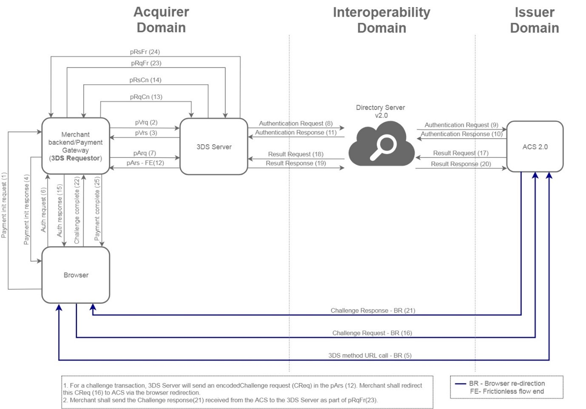

# 3DSS Protocol 2.0

#### What is 3D Secure 2.0?

3-D Secure 2.0 (3DS2) is designed to address the issues that comes with 3-D Secure, namely providing a frictionless experience without compromising on the security of the transaction. 3DS2 is an innovation of EMVCo, an organisation consisting of 6 major card networks.

When the customer wants to make a transaction, data is first sent to the cardholder's bank to see if the transaction needs any additional level of verification. Over 100 data elements are sent, and only suspicious transactions would need the extra verification. This is also known as “challenge flow”.

If any additional verification is not needed it is termed “frictionless flow”.

The main purpose of the new 3D Secure 2.0 protocol is to better facilitate information exchange between the three parties of the transaction. The good news is, with improved 3D Secure 2.0 protocol, the merchants can now both better prevent frauds and deliver enhanced customer experience.

3DS 2.0 simplifies the payment process. Instead of static password that had to be remembered in version 1.0, the 3DS 2.0 protocol uses a token-based and biometric authentication like face or voice recognition.

Overall, the new 3D Secure 2.0 technology means less checkout hassle for customers, shorter waiting time, fewer passwords to remember, and most importantly, fewer steps when completing the purchase.

Unlike the previous version of 3D Secure, the 2.0 protocol supports non-browser-based payment methods including wearables, in-app purchases, mobile payments, and digital wallets.

3DS 2.0 also promises improved risk assessment. When approving or declining a 3DS 2.0 transaction, over 100 data points are being transferred to issuing banks. That’s almost 10 times more data points than the previous protocol used. The more information the system analyses when doing authentication, the better the chances of fraud prevention.

### 3DS 2.0 Web Flow

1\) 3DS Requestor initiates pVrq(2) versioning request with 3DS Server

2\) 3DS Server responds with pVrs(3) versioning response and provides the version supported by ACS and DS for the card BIN range. In this case, version is 2.1.0

3\) If a ACS method URL is available as part of the pVrs response, the 3DS requestor will load the method URL and redirect to ACS.

4\) Once the method URL notification is received from ACS, the 3DS Requestor initiates pArq(7) with 3DS Server with message\_version as 2.1.0

5\) 3DS Server initiates AReq message with DS which is then sent to the ACS. ACS processes the request and sends an ARes.

6\) If the ARes is received with status = "Y", 3DS Server will respond to the 3DS requestor in the pArs(12) with key values eci and cavv.

7\) If the ARes is received with status = "C", 3DS Server will create a CReq(Challenge request-16), base64 encode it and initiate pArs(12) with the encoded Creq and ACS URL for browser redirection.

8\) 3DS Requestor redirects customer browsing by posting the CReq(16) received from 3DS Server to the ACS URL.

9\) ACS to perform challenge processing and complete RREQ/RRES leg.

10\) After receiving RRES, ACS redirects customer browser back to 3DS Requestor with a Cres(Challenge response-21)

11\) 3DS Requestor to make pRqFr (23) call to 3DS Server and pass the CRes received from ACS to 3DS Server.

12\) 3DS Server decodes CRes and extracts key fields like eci, cavv.

13\) 3DS server responds to 3DS Requestor with pRsFr(24) with eci, cavv.

14\) 3DS requestor initiates authorisation call with acquirer.

### 3DS 2.0 App Flow

1\) Merchant app initializes (1) SDK and receives device data in the response.

2\) Merchant app sends the device data to the 3DS requestor.

3\) 3DS Requestor initiates pVrq(3) versioning request with 3DS Server

4\) 3DS Server responds with pVrs(4) versioning response and provides the version supported by ACS and DS for the card BIN range. In this case, version is 2.1.0.

5\) The 3DS Requestor initiates pArq(5) with 3DS Server with message\_version as 2.1.0

6\) 3DS Server encrypts the device data and initiates AReq message with DS which is then sent to the ACS. ACS processes the request and sends an ARes.

7\) If the ARes is received with status = "Y", 3DS Server will respond to the 3DS requestor in the pArs(10) with key values eci and cavv.

8\) If the ARes is received with status = "C", 3DS Server will initiate pArs(10) and notify the 3DS Requestor to initiate a challenge request.

9\) The merchant app is notified and requests SDK to initiates challenge request (12).

10\) The SDK initiates a challenge request CReq(13) to the ACS directly.

11\) ACS to perform challenge processing and complete RREQ/RRES leg.

12\) After receiving RRES, ACS responds to SDK with a final Cres (Challenge response-18). Multiple Creq/Cres exchanges happen until the final validation is complete.

13\) 3DS requestor is notified of the challenge completion.

14\) 3DS Requestor to make pRqFr(21) call to 3DS Server.

15\) 3DS server responds to 3DS Requestor with pRsFr(22) with eci, cavv.

16\) 3DS requestor initiates authorisation call with acquirer.
