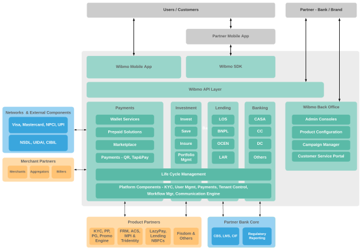
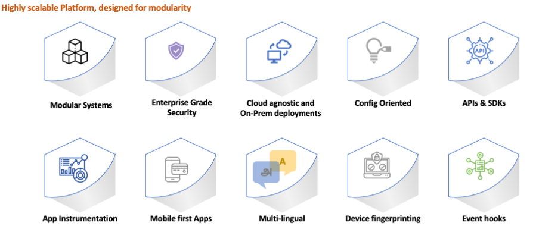

# BankEzy

BankEzy is an end-to-end Digital Financial Services Platform designed to help Banks, Fintechs, NBFC & Brands to embed and launch innovative financial products for their customers. Some of the key products supported on BankEzy are

· Wallet / Prepaid

· UPI

· Scan & Pay

· Marketplace

· Rewards & Loyalty

· Investments

· Lending

BankEzy platform is pre-integrated with other Wibmo Products like PG, Trident FRM, ACS, Tridentity etc. and these can additionally be availed as needed. The open architecture of the platform though allows other external products to be integrated seamlessly as well.

The below diagram gives a high-level view of the core components of BankEzy and how they can be offered to your customers.

BankEzy is a cloud native platform built on the latest tech stack to provide greater scalability and better performance. Some of the key platform capabilities are highlighted below

