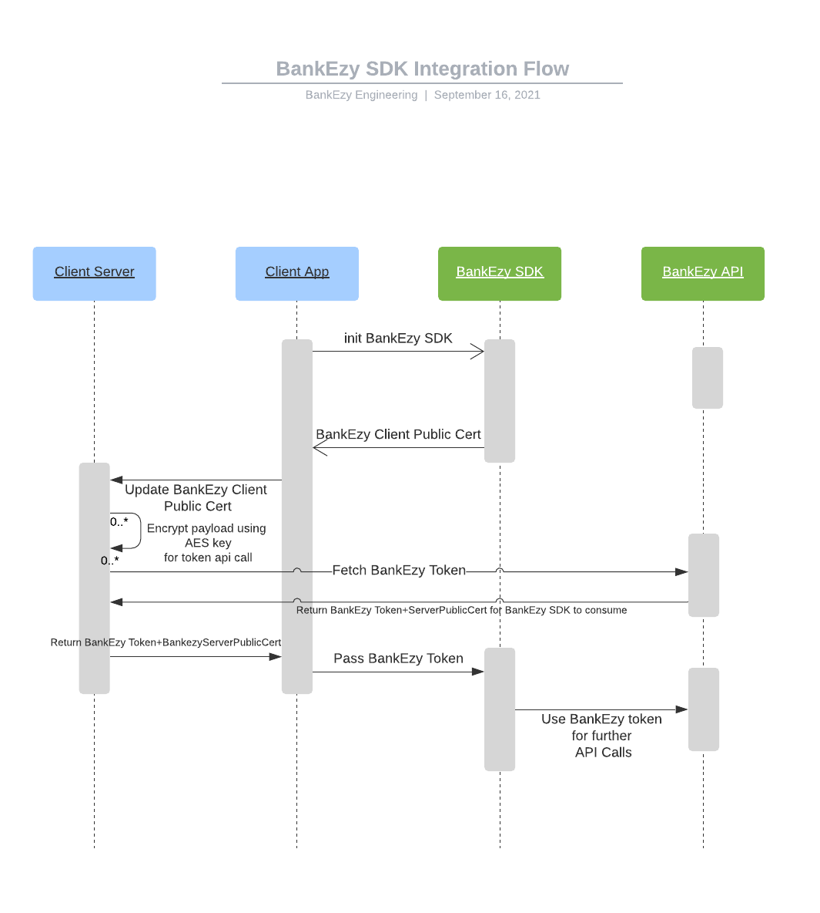

# Market place

Marketplace is a module in BankEzy where the platform is pre-integrated with more than 40+ merchants in single place. It is SDK based offering where the partners app has to integrate with BankEzy SDK. Following are the key features in this module

1. Frequent release of partner specific coupons from individual merchant
2. Merchants categorised based on the business type
3. Popular merchant list for easy access to customer
4. Global search where the customer will be able to search for a merchant
5. Newly added merchants are shows in the bottom footer for easy identification
6. The partner also receives commission once the users make purchases through the respective merchants. The commission would vary basis the merchant and the sub-category on the merchant website. &#x20;
7. It facilitates the app users with actions like mobile and dth recharge and Bill payments like electricity, gas, postpaid etc

## Onboarding into BankEzy platform

Any partner to consume BankEzy api, they needs to be first onboarded into BankEzy platform. As part of onboarding process following details will be shared with the partner

1. API Key
2. Encryption key

Please contact sales@Wibmo.com for onboarding.

Once onboarded the Market place SDK will be shared.

## Integrating with Android SDK

Follow the below steps to integrate your app with BankEzy market place SDK

1. Do necessary gradle changes and get the client public key from BankEzy SDK as explained in this [step ](sdk-integration/android.md#step-1-gradle-changes-app-build.gradle)
2. Pass the client public key to your server. From your server call [Get token api ](api-specification/version-1/get-token-api.md)to generate token. Mechanism to connect to BankEzy server is explained in section [API Reference Guide.](../api-reference-guide.md)
3. Pass the received BankEzy token and server public key to your app
4. From your app initialise BankEzy app as explained [here](sdk-integration/android.md#step-3-initialisation-of-sdk).&#x20;
5. If the token expires you can renew it using [Renew token api](api-specification/version-1/renew-token-api.md).
6. While logging off from your app call [Invalidate token api ](api-specification/version-1/invalidate-token-api.md)to invalidate the BankEzy token.

## Integrating with iOS SDK

Follow the below steps to integrate your app with BankEzy market place SDK

1. Do necessary changes as explained in this [step](sdk-integration/ios.md#step-1-sdk-and-dependencies) for SDK integration to and get the client public key from BankEzy SDK
2. Pass the client public key to your server. From your server call [Get token api ](api-specification/version-1/get-token-api.md)to generate token. Mechanism to connect to BankEzy server is explained in section [API Reference Guide.](../api-reference-guide.md)
3. Pass the received BankEzy token and server public key to your app
4. From your app initialise BankEzy app as explained [here. ](sdk-integration/ios.md#step-3-initialisation-of-sdk)
5. If the token expires you can renew it using [Renew token api](api-specification/version-1/renew-token-api.md).
6. While logging off from your app call [Invalidate token api ](api-specification/version-1/invalidate-token-api.md)to invalidate the BankEzy token.
