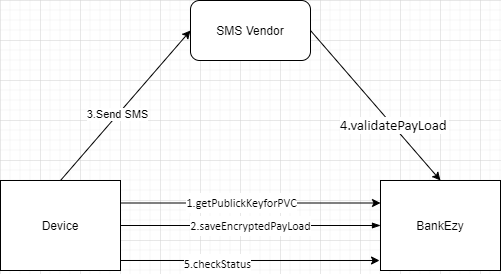

# Sim and Device Binding

This feature is used to enable one touch payment if sim and device binding is successfully completed. For this purpose, below APIs are used.

* Generating a RSA Key for a user, Private Key will be saved at server end and public key will be shared to app. [Learn More](broken-reference)
* App needs to encrypt the device unique Id of the user by using the public key which was shared in previous API. [Learn More](../../../../version-1/customer-on-boarding/api-specification/sim-and-device-binding/save-encrypted-payload-api.md)
* Then App will send a message to SMS vendor. After that SMS vendor will call back to the backend to validate the SMS. [Learn More](../../../../version-1/customer-on-boarding/api-specification/sim-and-device-binding/validate-payload-api.md)
* Meanwhile app will check for the status. whether the sim and device binding successfully completed or not. [Learn More](../../../../version-1/customer-on-boarding/api-specification/sim-and-device-binding/check-status-api.md)
* [Sim verification API](../../../../version-1/customer-on-boarding/api-specification/sim-and-device-binding/sim-verification-api.md) will be called when one tap payment mode is enabled at program level.

