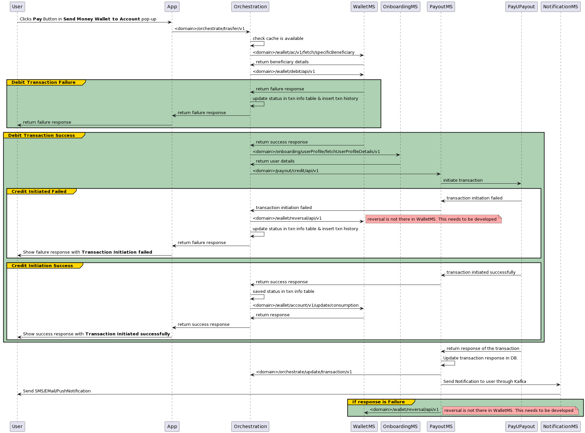

# Wallet to Account

This feature is used for a registered full KYC Bankezy wallet user able to transfer money from Bankezy wallet to any user's bank account/UPI handle.

1. Transaction validation [w2a-verification-api.md](api-specification/w2a-verification-api.md "mention")
2. Transaction Initiation [w2a-transaction-api.md](api-specification/w2a-transaction-api.md "mention").
3. once credit happened/failed callback will happen. At that time BankEzy will update the status of the transaction.
4. User can ensure the status of the transaction in transaction history. Once BankEzy got callback system will notify the user.

