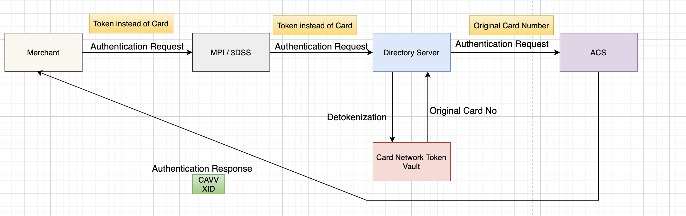

# Authentication

Authentication for the tokenized cards performed with the token instead of the original card number.

Authentication using Token Flow

* For purchase transaction, merchant sends authentication transaction to MPI / 3DSS.
* MPI Sends the request to DS. DS connects card network to detokenize the card number.
* DS sends original card number to ACS.
* ACS authenticates it and sends CAVV and XID values on the successful authentication.
