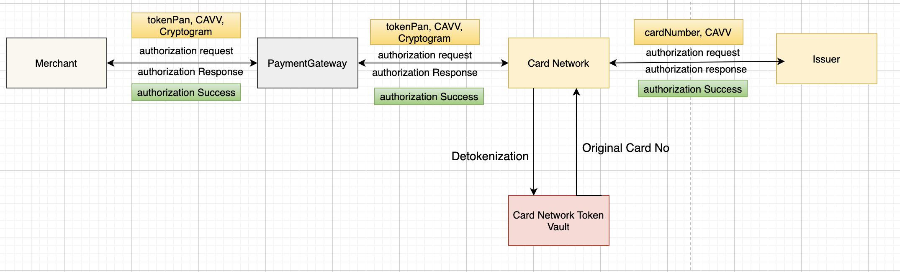

# Authorization

Authorization is performed for Token based transactions with authentication code (CAVV) and Cryptogram.

Authorization using Token flow

<figure><figcaption></figcaption></figure>

* Once authentication is successful, Merchant initiates authorization to his payment gateway.
* Merchant sends token, cavv (from authentication response) and cryptogram (from getTokenData response) to the Payment gateway. PG sends authorization request to the card network.
* Card network call its token vault to detoknize the card ands sends the original card number to the issuer in the authorization call.
* Issuer authorizes the transaction and send the status back.
