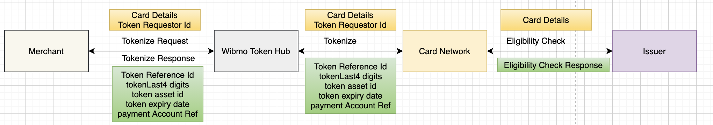

# Tokenization

#### What is **Tokenization?**

Process of replacing sensitive information with a non - sensitive information \[token]either completely or partially, rendering the token useless for unintended user.

Tokens are irreversible, cannot be traced back to original information using a key. It follows principle of ‘pseudonymization’ \[Pseudo Anonymization or simply put alias or surrogate] for sensitive data like SSN, Credit Card, Bank ac/c, phone, or DOB.

A tokenization system links the original data to a token but does not provide any way to decipher the token and reveal the original data

Token PAN are generated using the Format Preserving Hash which are irreversible PAN and Lunh’s check is passed on the same following EMVCo standards. For same card ‘99’ tokens can be generated and once exceeds the limit needs to delete the tokens to create new tokens. \[ as per the industry standards]

• PAN : 5111 1111 1111 1111

• Token PAN Generated 6667 2397 1422 2655

• Token Reference ID : 94c66fc9-76b4-43f5-81ff-0bc495c0b0fb20210920. \[ Unique per token]

<figure><figcaption></figcaption></figure>

Tokenize Service Flow

1. Merchant / PA sends card tokenize request to Wibmo Token Hub.
2. Wibmo Token Hub tokenizes the card and sends the token details back to the merchant.
3. Merchant stores / saves card details in tokenized form.
