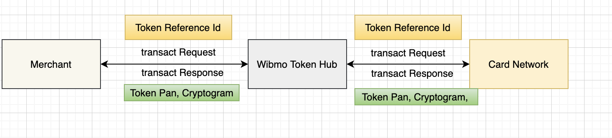

# Transact

Transact is the process of getting cryptogram and token from the network before performing authentication and authorization.

<figure><figcaption></figcaption></figure>

1. Merchant initiates transact call to get Token Pan and cryptogram. Token Pan will be used instead of original card number for authentication and authorization. Cryptogram is required to be passed for payment authorization.
2. Card network responds back with Token Pan and cryptogram which will be sent back to the merchant.
